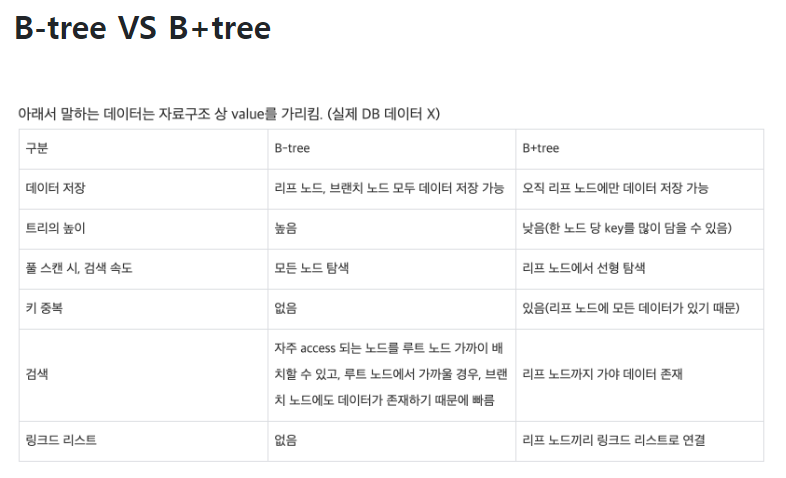
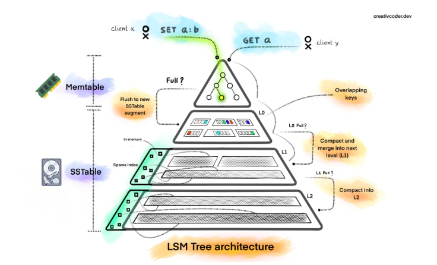

# db 인덱스란 

추가적인 쓰기 작업과 저장 공간을 활용하여 데이터베이스 테이블의 검색 속도를 향상시키기 위한 자료구조

# B tree 의 특징

1. 노드에는 2개 이상의 데이터(key)가 들어갈 수 있으며, 항상 정렬된 상태로 저장된다.
2. 내부 노드는 M/2 ~ M개의 자식을 가질 수 있다. 최대 M개의 자식을 가질 수 있는 B 트리를 M차 B트리라고 한다.
3. 특정 노드의 데이터(key)가 K개라면, 자식 노드의 개수는 K+1개여야 한다.
4. 특정 노드의 왼쪽 서브 트리는 특정 노드의 key 보다 작은 값들로, 오른쪽 서브 트리는 큰 값들로 구성된다.
5. 모든 리프 노드들이 같은 레벨에 존재한다.

# B tree 및 B + tree 의 특징

디스크 I/O 최소화 즉 red-black treee , avl tree 보다 disk io

# clustered index
1. Innodb 기준 pk 값으로 정렬된 기본 인덱스
2. leaf 에 데이터 존재
3. 테이블당 하나만 기준

# non-clustered index
1. 테이블당 여러개 기준 생성가능
2. leaf 에 pointer 존재
3. clusterd index 에 비해 update/delete 속도가 빠름

# convering index
1. 실제 데이터 접근" 의 행위 없이 인덱스에 있는 컬럼 값들로만 쿼리를 완성
2. 조건 :  인덱스의 순서

# nosql 에서의 index

# LSM, b-tree , bloom filter
1. 디스크상의 데이터 파일의 바이트 오프셋에 매핑 -> 인메모리구조 avl ,redblack tree 가 더 적합

2. 각 stage 별 hit 율을 높여서 disk i/o 를 줄이기이위한 bloomfilter 사용

3. log structrued 구조 ( hash map ) 은 range query 에 weak
