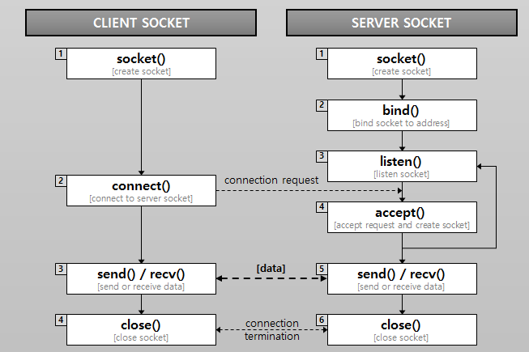
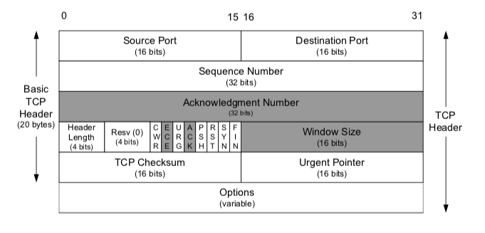
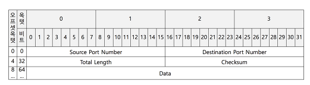

# 네트워크 프로토콜 정리

## socket 
1. socket 은 IPC 기술중 하나이다
2. 양방향 통신이며 synchronous communication 이다.
3. 네트워크 기본은 socket 통신으로 이루어진다.

## 4계층 tcp udp
1. tcp 는 4way 3way 를 통한 교환 <-> udp 는 비연결성
2. tcp 는신뢰성 보장 <-> 순서상관 x
3. p2p fullduplex <-> 흐름제어 x
4. tcp : packet <-> udp : datagram
5. tcp 속도 : udp 속도 ( 지연 x )

tcp 헤더

udp 헤더

## http vs socket
1. tcp 는 socket 기반 네트워킹 (ip 번호 및 port 로 식별자가 존재)
2. http는 소켓기반 but http 는 단방향 ( 특정 케이스에대한 문제가 생김 )

## http problem
1. http 1 에서는 지속적으로 데이터를 주고 받을 경우에 대한 문제가 생김 따라서 이를 http 1.1 에서 보완
2. http 1.1 에서는 keep alive 로 handshake 이후 과정 생략 후 전송가능
3. http 1.1 에서는 pipelining 으로 인한 병렬 처리 가능 ( ack 는 send 순서대로 )
4. but HOL 문제로 인한 ( TCP 도 기본 HOL 를 가지고 있음 ) 문제 발생
5. 이를 해결 하기위해서 http2 에서는 순서보장 x 병렬처리가능 http 1.1 문제 해결

