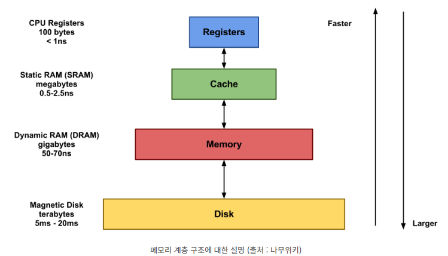

# 메모리 계층

 * 처리속도가 빠르고 비싼 것에서 느리고 저렴한 것으로 순차적으로 구성

	* 레지스터(Register): CPU 내부에 있어 가장 빠르지만 용량이 아주 제한적입니다.
	* 캐시 메모리(Cache Memory): CPU와 직접 연결되어 있어 빠른 접근 속도를 가지나, 레지스터에 비해 용량이 더 큽니다.
	* 주 메모리(Main Memory 또는 RAM): 대부분의 애플리케이션과 데이터가 저장되는 공간으로, 캐시보다는 느리지만 훨씬 큰 용량을 가집니다.
	* 보조 메모리(Secondary Memory): 하드 드라이브, SSD 등을 포함하며, 주 메모리보다 느리지만 엄청난 저장 공간을 제공합니다.

# 메모리 관리

 * 스와핑(Swapping)
	* CPU에서 실행되지 않는 프로세스 중 일부를 메모리가 아닌 디스크에 저장하는 기법
	* swap in : 디스크 → 메모리
	* swap out : 메모리 → 디스크
	
# 메모리 할당

 * 연속 할당
	* 고정 분할 방식 - 내부 단편화 발생
	* 가변 분할 방식 - 외부 단편화 발생
		* 최초적합 - 위나 아래에 찾은 첫번째 홀에서 시작
		* 최적적합 - 프로세스의 크기 중 가장 알맞는 공간에 할당 (느림)
		* 최악적합 - 프로세스의 크기와 가장 많이 차이가 나는 홀에 할당
		
 * 비연속 할당
	* 메모리 압축
		* 짜투리 메모리들을 하나로 합쳐 큰 메모리로 확보 (== 디스크 조각 모음)
		* 외부 단편화 해결 가능
		* 꽤 시간이 필요한 작업이기 때문에 비효율적
	* 페이징(paging)
		* 메모리 공간이 연속적이어야 한다는 제약 없앰
		* 한 프로세스의 논리 주소 공간을 여러 개로 분할하여 비연속적인 물리 메모리 공간에 할당
		* 외부 단편화 해결, 내부 단편화 해결x
	* 세그먼테이션(Segmentation)
		* 페이징에서 처럼 논리, 물리 메모리를 같은 크기의 블록이 아닌, 서로 다른 크기의 논리적 단위인 세그먼트로 분할
		* 외부 단편화 해결x, 내부 단편화 해결
	* 메모리 풀(Memory Pool)
		* 필요한 메모리 공간을 필요한 크기, 개수만큼 사용자가 직접 지정하여 미리 할당받고 필요할 때마다 사용, 반납하는 기법
		* 메모리 할당, 해제가 잦은 경우 효과적
		* 외부 단편화, 내부 단편화 발생 x
		* 메모리 풀을 만들었지만 쓰지 않았을 때도 계속 할당된 상태이므로 메모리 누수가 발생.
		
    * 페이지 교체 알고리즘
	
		* 오프라인 알고리즘 
		* FIFO : 가장 먼저 온 페이지를 교체 영역에 가장 먼저 놓는 방식
		* LRU : 참조가 가장 오래된 페이지를 교체
		* NUR : 일명 clock 알고리즘
		* LFU : 참조가 적은 페이지 교체
	
 
 