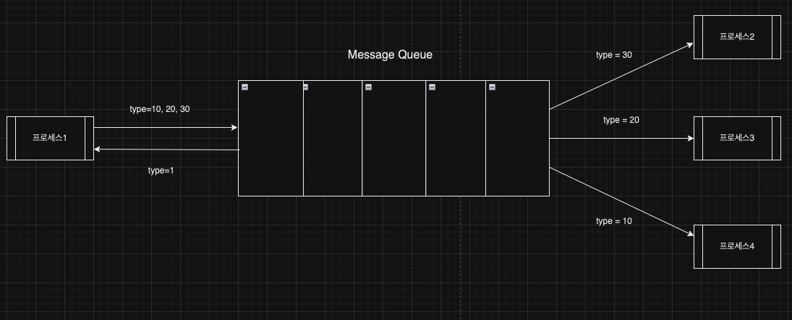
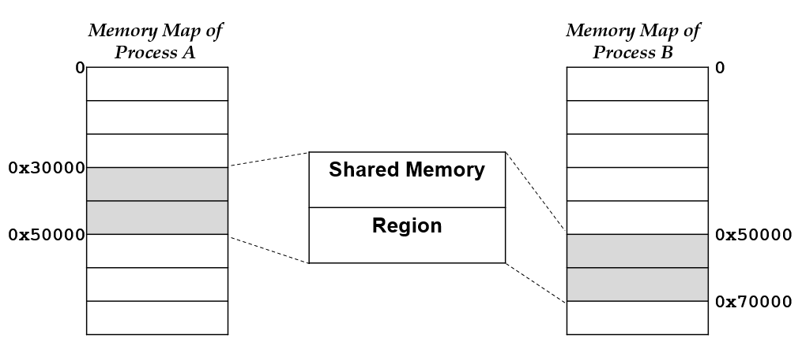

# 멀티 프로세싱, 멀티 스레딩

## 1. 멀티 프로세싱
- 2개 이상의 프로세서를 갖는 시스템
- 위의 결과로, 동시에 실행되는 프로세스가 존재한다.

<br/>

**참고. 멀티프로그래밍?**
하나의 프로세서에서 여러개의 프로세스가 실행되는 것을 의미한다.
- cpu의 개수에서 multiprogramming과 multiprocessing의 차이가 있다.
- cpu utilization 증가

<br/>

프로세스는 메모리 주소 공간을 다른 프로세스와 공유하지 않는다. 그렇다면 프로세스 사이에서 이들의 통신은 어떻게 이루어질까?

<br/>

## 1.1 IPC(Inter-Process Communication)

- 서로 다른 프로세스들 사이에 서로 데이터를 주고 받는 행위 또는 방법

<br/>

### a. PIPE(익명 PIPE)

- 하나의 프로세스는 오직 write만, 하나의 프로세스는 오직 read 만 할 수 있는 구조
  - 반이중 통신(half-duplex communication)
- 만약 양방향 통신을 원한다면, pipe를 하나 더 만들어, 반대 방향으로 데이터가 전송되는 pipe를 만들면 된다.
- `|` 명령어를 통해 pipe를 만들 수 있다.
- file IO subsystem으로 구현
  - Unix의 경우, `pipe` system call을 통해, pipe의 read를 참조하는 file descriptor, write를 참조하는 file descriptor 쌍을 반환한다.
- 프로세스에서 write한 여러개의 데이터를 다른 프로세스에서 순서대로 읽는다.

<br/>

**pros**
- 단순함
  - 자식 부모 프로세스 사이의 단방향 통신에 적합
- 통신할 프로세스를 명확하게 아는 경우

<br/>

**cons**
- pipe가 식별이 되지 않기 때문에, 부모가 다른 프로세스 사이의 통신은 할 수 없음
- 양방향 통신일 경우, pipe가 추가적으로 필요함
  - 다수의 프로세스 사이의 통신이라면, 많은 pipe가 필요 -> pipe 관리 난이도 상승
  - file I/O를 통해 통신하기 때문에 shared memory에 비해 느리다.
- 프로세스가 사라지면, pipe도 소멸 -> 프로세스의 실행 종료가 빈번하면 계속해서 pipe를 생성하기 때문에 비효율적

<br/>

### b. Name pipe
- pipe를 식별하기 위해, 이름이 부여된 pipe
- 프로세스가 사라져도, 시스템이 죽지 않는 한, pipe는 여전히 남아있다.
  - 더 이상 사용되지 않는다면, 제거 될 수 있다.
- named pipe는 일반적으로, file를 통해 나타난다.
  - `mkfifo()`를 통해 생성되며, 개별 프로세스들은 이름으로  pipe에 접근 할 수 있다.
- 반이중 통신

<br/>

 **pros**
- 부모가 다른 프로세스들 사이의 통신
- 프로세스가 종료되도, pipe를 유지하고 싶을 때

<br/>

**cons**
- 여전이 한쪽은 write만 가능하고, 다른 한쪽은 read만 가능
- 다수의 프로세스 사이의 통신 시, 여러개의 pipe를 만들어야한다. 따라서 pipe 관리의 어려움이 존재한다.

<br/>

### c. Message Queue

작동 방식은 pipe와 동일하나, 작업이 이루어지는 공간이 file이 아닌, memory에서 이루어진다
- 데이터에 번호를 부여하기 때문에, 프로세스는 번호를 보고, read 할 지, 하지 않을 것인지 결정 할 수 있다.
  - 다수의 프로세스 사이의 통신이 가능
  - 참고로 pipe는 데이터를 bytestream으로 전송하기 때문에, 번호를 부여 할 수 없음(i.e. 데이터 간의 경계가 존재하지 않음)
- 커널에서 링크드 리스트로 관리한다.
- 양방향 통신 가능

<br/>

**message에 대한 자료구조**

```c
struct msqid_ds {		/* <sys/msg.h> */
	struct ipc_perm 	 msg_perm;   /* see ch08_ipc1-p.29 */
	struct msg	*msg_first;  /* ptr to first message on queue */
	struct msg	*msg_last;   /* ptr to last message on queue */
	msglen_t	 msg_cbytes; /* current #bytes on queue */
	msgqnum_t 	 msg_qnum;   /* # of messages on queue */
	msglen_t 	 msg_qbytes; /* max # of bytes on queue */
	pid_t 		 msg_lspid;  /* pid of last msgsnd() */
	pid_t 		 msg_lrpid;  /* pid of last msgrcv() */
	time_t 		 msg_stime;  /* last-msgsnd() time */
	time_t 		 msg_rtime;  /* last-msgrcv() time */
	time_t 		 msg_ctime;  /* last-change time */
};
```

<br/>

**pros**
- 다수 프로세스 사이의 통신을 할 때 사용

<br/>

**cons**
- 대규모 데이터를 전송할 때 메모리를 얼마나 확보 할 수 있는가
- 빠르게 처리할 수 있는 데이터가 나중에 오고, 빠르게 처리가 불가능한 데이터가 먼저 올 때 어떻게 할 것인가
- 비동기에 대한 고민
  - 코드의 가독성을 해치지 않으면서 데이터를 read할 때까지 기다리지말고, 다른 할 일을 하면 안되는가?

<br/>

### d. Memory map



- pipe, message queue 모두 통신을 위해, media가 존재했다면 shared memory는 공유된 메모리를 통해 데이터에 바로 접근 할 수 있음
- 프로세스가 공유 메모리 할당을 커널에게 요청하면, 커널은 해당 프로세스에게 공유 메모리를 할당
  - 이후 다른 프로세스들은 이 메모리를 통해 데이터에 접근 할 수 있다.
- virtual memory이기 때문에, 프로세스의 주소 공간은 서로 다를 수 있다.
- media를 통해 통신을 하지 않기 때문에, IPC 중에서 가장 빠르다.
- 양방향 통신이 가능하다.

<br/>

**pros**
- 빠르게 데이터를 전송하고 싶을 때

<br/>

**cons**
- 동기화
  - 다수 프로세스들이 동시에 같은 데이터를 읽고 쓸 때, 데이터의 정합성을 어떻게 보장 할 것인가

<br/>

### e. Semaphore
- 프로세스 사이에서 발생하는 동기화 문제를 lock을 통해 해결
- 프로세스는 semaphore(열쇠)를 획득해서, 데이터에 접근 할 수 있다.
- 만약 사용가능한 semaphore가 존재하지 않는다면, 프로세스는 semaphore를 획득 할 때까지, 데이터에 접근 할 수 없다.

<br/>

**pros**
- 자원에 대한 동기화 보장
- 블로킹 메커니즘
- 
<br/>

**cons**
- 데드락
- 구현의 복잡성
  - semaphore operation(wait, signal)이 atomic을 보장해야한다. 
  - 어떻게 하면 semaphore를 사용해서 효율적이고 정확한 동기화를 구현할 것인가

<br/>

socket은 네트워크에서 언급됐기 때문에 생략