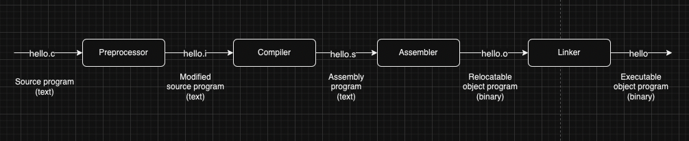
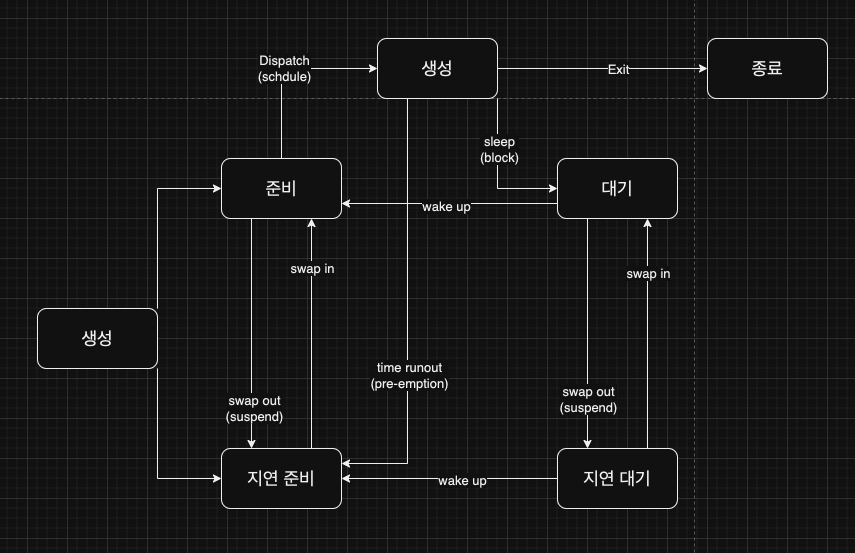
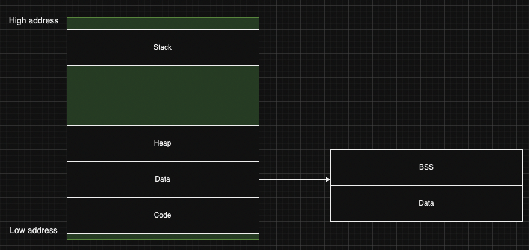

# 프로세스와 스레드

## 01. 프로세스 컴파일 과정

 

 

- preprocessor : `#` directive를 처리하여, 다른 c program으로 변형한다.
  - preprocessor가 `#include<stdio.h>`의 내용을 읽어서 이를 program text에 추가 
  - 일반적으로, `.i` suffix가 붙는다.

 

- compiler : `hello.i`를 `assembly language program`을 포함하는 `hello.s`로 변환
  - assembly language는 다른 언어들일 사용하는 컴파일러에 상관없이, 동일한 output을 제공하기 때문에 유용하다.

 

- assembler : `hello.s`를 machine-language 명령어로 변환하고, 이를 `relocatable object program`이라는 형태로 패키징하여, 결과를 object file에 저장한다.

 

- linker : `hello` program이 `printf`를 호출한다고 가정하자. `printf`함수는 `printf.o`라는 별개의 사전 컴파일된 object file이다. 
따라서 `hello.o` program과 `printf.o`를 merge해야하는데, linker가 이를 담당한다.

 

## 02. 프로세스의 상태

 

 

### 2.1 프로세스 상태

- 생성 : 프로세스가 생성된 상태. `fork()` 또는 `exec()`함수를 통해 프로세스가 생성된다. 생성 상태에서 PCB가 할당된다.
- 준비 : 프로세스가 메모리에 적재 됐고, 실행을 위해 프로세서에 할당되기를 기다리고 있는 상태
- 실행 : 프로세스가 현재 프로세서에 의해 실행되고 있는 상태
- 대기 : 프로세스가 어떤 이벤트가 발생하는 것을 기다리거나, 자원이 사용가능하기를 기다리고 있는 상태
  - 이 때, 프로세스는 프로세서를 활용하지 않음
- 종료 : 프로세스가 실행을 완전히 마친 상태

 

### 2.2 프로세스 상태 전이
- dispatch(또는 scheduling) : 준비 -> 실행
  - 준비 상테에 있는 다수의 프로세스들 중, 실행될 프로세스를 선정하여 CPU 할당. 이 때 context switch가 발생 할 수 있음
- timer runout : 실행 -> 준비
  - CPU를 할당받은 프로세스는 지정된 시간이 초과되면, CPU를 양도하게된다.
- block : 실행 -> 대기
  - 실행 중인 프로세스가 I/O요청 또는 시스템 콜, 프로세스 통신을 시작하게 되면, CPU를 양도한다.
- wake up : 대기 -> 준비
  - I/O작업이 완료되면, 프로세스는 대기상태에서 준비상태로 전이하게 된다.
- swap-in : 지연준비/지연대기 -> 준비/대기
  - 프로세스가 다시 메모리에 적재될 때, 상태 전이가 발생
- swap-out : 준비/대기 -> 지연준비/지연대기
  - 프로세스가 메모리 -> 디스크로 저장될 때, 상태 전이가 발생

 

### 2.3 그 외 프로세스 종류

 

데몬 프로세스
- 백그라운드에서 계속 실행되는 프로세스

 

좀비 프로세스
- 자식 프로세스가 본인의 상태를 알리지 않은 상태에서 죽게되면, 좀비 프로세스가 된다. OS는 자식 프로세스의 정보를 여전히 유지한다.
- 좀비 프로세스가 많을 경우, 프로세스 테이블에 계속 유지가 되기 때문에, 새로운 프로세스를 생성하지 못하는 상황이 발생 할 수 있다.

 

고아 프로세스
- 부모를 잃은 자식 프로세스
- 고아 프로세스는 OS의 제어를 받는다. 다시 말해, init 프로세스를 부모로 설정하기 떄문에, 고아 프로세스가 되어도, 시스템에 영향을 주지 못한다.

 

### 03. 프로세스 메모리 구조

 

 

stack
- 함수 호출과 관련하여, 지역변수와 매개변수가 저장되는 영역
- 함수 호출 시, 할당되며 함수 호출이 완료되면 소멸
- 메모리의 높은 주소 -> 낮은 주소로 할당

 

heap
- 런타임에 크기가 결정되는 영역
- 사용자에 의해, 공간이 동적으로 할당 및 해제
- 참조형 데이터를 할당 할 때
- 메모리의 낮은 주소 -> 높은 주소로 할당

 

data
- 전역 변수를 저장하는 영역
- program이 전역 변수를 사용한다면, 이 program은 컴파일 후, data 영역을 참조
- program 시작과 함께 할당되며, program 종료시 소멸
- 초기화되지 않은 변수는 data의 bss 영역에 저장된다.

 

text
- program에 대한 machine code를 저정하는 영역
  - read-only 상태로 저장

 

## 04. PCB

 

PCB(Process Control Block)
- 프로세스에 대한 메타데이터
- 일반 사용자가 접근하지 못하도록, 커널 스택의 가장 앞부분에 관리

 

PCB 구조
- 프로세스 스케줄링 상태
- 프로세스 ID
- Program Counter(PC) : 프로세스에서 실행해야할 다음 명령어의 주소에 대한 포인터
- CPU 레지스터 : 프로세스를 실행하기 위해, 저장해야할 레지스터 정보
- CPU 스케줄링 정보 : CPU 스케줄러에 의해 중단된 시간등에 대한 정보
- 계정 정보 : 프로세스 실행에 사용된 CPU 사용량, 실행한 사용자 정보
- I/O 상태 정보 : 프로세스에 할당된 I/O 디바이스 목록

 

참고: 한 프로세스 내, 스레드들은 PCB를 공유한다.

 

### 4.1 컨텍스트 스위칭(Context switching)

 

context swithcing
- PCB를 교환하는 과정
- 컨텍스트 스위칭은 프로세스에 할당된 시간이 끝나거나, 인터럽트에 의해 발생

 

context switching 시,
1. 인터럽트 또는 트랩에 의한 요청이 발생
2. OS는 현재 실행주인 프로세스의 정보를 PCB에 저장
3. OS는 다음 프로세스의 정보를 PCB에 가져온 후, CPU에 할당

 

context switching이 발생하는 시기는
- 인터럽트가 발생 할 때
- 사용자 모드 -> 커널 모드
- 커널 모드 -> 사용자 모드

 

프로세스 context switching vs 스레드 context swithcing
- 프로세스의 context switching은 메모리 주소 공간도 같이 switching되지만, 스레드 context switching은 메모리 주소 공간이 남는다.
- 프로세스는 프로세스 메모리 주소 공간은 공유하지 않지만, 스레드는 stack을 제외한 나머지 영역을 공유 -> 스레드 context switching 비용이 더 낮다.

 

