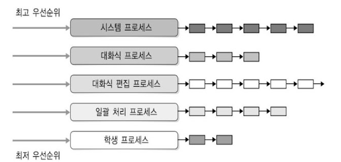
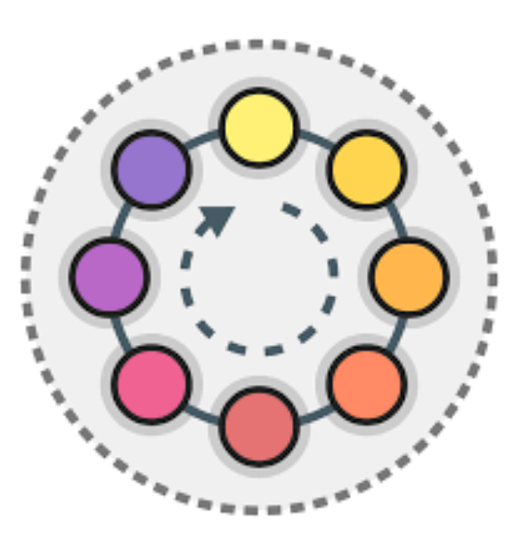
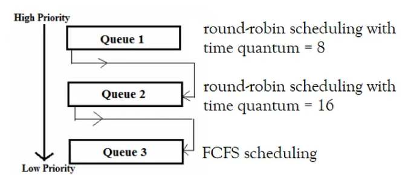

# 큰 수준에서의 스케쥴링이란
1. 고수준의 스케쥴링 ==> process 활성 여부
2. 중간수준 스케쥴링 ==> process 수를 제어
3. 저수준의 스케쥴링 ==> process 순서를 제어

# 선점과 비선점
선점 : 실행중인 상태의 작업을 중단시키고 새로운 작업을 실행할 수 있다.
비선점 : 실행 작업이 있는 작업이 완료될 때까지 다른 작업이 불가능하다.

# 우선순위 큐

READY STATE , WAITING STATE 비롯해서 우선순위큐로 관리

# FCFS (QUEUE)
1. 큐를 기준으로 도착한 순서대로 cpu 에할당
2. 우선순위가 동일 
3. 점유가 긴 프로세스가 들어가면 뒤가 지연됨

# SJF 
1. 실행기간이 짧은 작업 부터 할당
2. starvation 일어날 수 있음

# HRN 
1. 우선순위 = (대기시간 + cpu 사용시간)/cpu 사용시간 으로 우선순위값을 높임
2. 아사현상 해결
3. 대기시간이 긴 프로세스 우선순위를 높임 -> 공정성 x

# Round Robin
1. time slice 에 대한 문제 ( context switching )

# multilevel feedback queue scheduling 
1. 우선순위를 multilevel 로 사용
2. 각 multilevel 단계에서 round robin 사용
3. 우선순위가 낮을수록 time slice 는 높음

